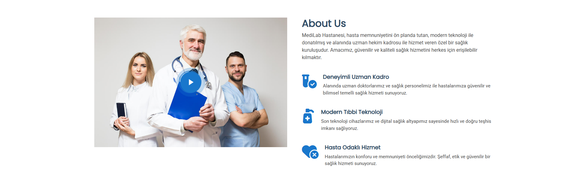
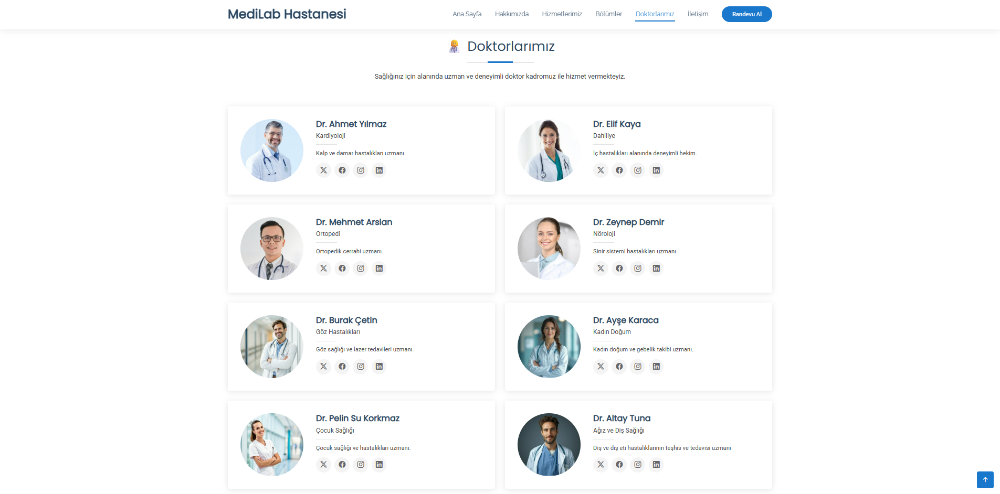
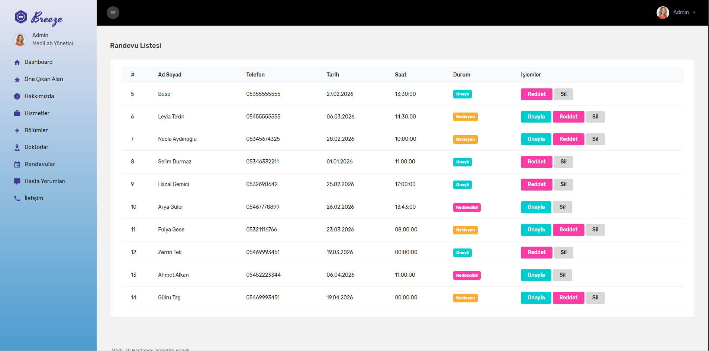
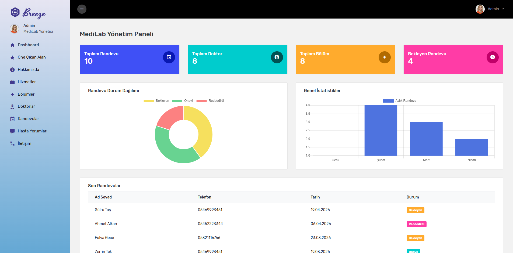

🏥 MediLab Hastane Yönetim Sistemi 🏥

🎯 Proje Hakkında
MediLab Hastane Yönetim Sistemi, ASP.NET Core 9 MVC mimarisiyle geliştirilmiş, modern ve ölçeklenebilir bir hastane yönetim platformudur. Proje; Dapper ORM, Repository Pattern ve ViewComponent mimarisi kullanılarak inşa edilmiştir.
Sistem iki ana bölümden oluşmaktadır:

🌐 Frontend: Hastalar için modern ve kullanıcı dostu arayüz
⚙️ Admin Paneli: Yöneticiler için kapsamlı içerik yönetim sistemi

✨ Özellikler ✨

🌐 Frontend

💠Modern ve responsive tasarım (MediLab Bootstrap Teması)
💠Dinamik Feature, About, Services, Departments, Doctors bölümleri
💠Swiper.js ile hasta yorumları (Testimonials) slider
💠Online randevu formu (Bölüm & Doktor seçimi)
💠SweetAlert2 ile kullanıcı bildirimleri
💠AOS (Animate On Scroll) ile sayfa animasyonları
💠İstatistik sayacı (PureCounter.js)
💠İletişim bilgileri ve harita

⚙️ Admin Paneli

💠Breeze Bootstrap Admin Template entegrasyonu
💠Dashboard: Chart.js ile randevu durum dağılımı ve aylık istatistik grafikleri
💠Feature Yönetimi: Öne çıkan alan CRUD işlemleri
💠About Yönetimi: Hakkımızda içeriği yönetimi
💠Service Yönetimi: Hizmetler CRUD işlemleri
💠Department Yönetimi: Bölüm yönetimi
💠Doctor Yönetimi: Doktor yönetimi (bölüm ilişkili)
💠Appointment Yönetimi: Randevu onaylama / reddetme / silme
💠Testimonial Yönetimi: Hasta yorumları yönetimi
💠Contact Yönetimi: İletişim bilgileri yönetimi

📅 Randevu Sistemi

💠Frontend'den online randevu oluşturma
💠Admin panelinde randevu listeleme ve durum yönetimi
💠Tek tıkla Onaylı / Beklemede / Reddedildi durum değişimi
💠Renkli badge'ler ile görsel durum takibi

📊 Dashboard
Admin paneli dashboard'unda aşağıdaki veriler görselleştirilmektedir:

📅 Toplam Randevu sayısı
👨‍⚕️ Toplam Doktor sayısı
🏥 Toplam Bölüm sayısı
⏳ Bekleyen Randevu sayısı
🍩 Doughnut Chart: Randevu durum dağılımı (Bekleyen / Onaylı / Reddedildi)
📊 Bar Chart: Aylık randevu istatistikleri
📋 Son Randevular tablosu

### 🌐 Frontend - Feature

### 🌐 Frontend - About

### 👨‍⚕️ Doktorlar

### 📅 Randevu

### 💬 Testimonials

### 📊 Dashboard
