🏥 Proje Hakkında
MediLab Hastane Yönetim Sistemi, ASP.NET Core 9 MVC mimarisiyle inşa edilmiş, Dapper ORM ve Repository Pattern kullanılarak geliştirilmiş modern ve ölçeklenebilir bir hastane yönetim platformudur.
Sistem üç ana bölümden oluşmaktadır:

🌐 Frontend: Hastalar için modern ve kullanıcı dostu arayüz
⚙️ Admin Paneli: Yöneticiler için kapsamlı içerik yönetim sistemi
👤 Hasta Paneli: Hastalar için kişisel randevu takip sistemi

✨ Özellikler
🌐 Frontend

Modern ve responsive tasarım (MediLab Bootstrap Teması)
Dinamik Feature, About, Services, Departments, Doctors bölümleri
Swiper.js ile hasta yorumları (Testimonials) slider
Online randevu formu (Bölüm & Doktor seçimi)
SweetAlert2 ile kullanıcı bildirimleri
AOS (Animate On Scroll) ile sayfa animasyonları
İstatistik sayacı (PureCounter.js)
İletişim bilgileri ve harita

⚙️ Admin Paneli

Breeze Bootstrap Admin Template entegrasyonu
Dashboard: Chart.js ile randevu durum dağılımı ve aylık istatistik grafikleri
Feature, About, Service, Department, Doctor, Appointment, Testimonial ve Contact modülleri için eksiksiz CRUD işlemleri
Randevu onaylama / reddetme sistemi
Doktor müsaitlik yönetimi (MHRS benzeri - tek tıkla durum değiştirme)
Randevu onayında MailKit ile otomatik HTML e-posta bildirimi

👤 Hasta Paneli

ASP.NET Core Identity ile güvenli kayıt & giriş sistemi
Rol bazlı yetkilendirme (Admin / Hasta)
Kişisel randevu takibi ve durum görüntüleme
Yeni randevu oluşturma
Profil bilgileri & şifre güncelleme
Müsait olmayan doktorlar randevu formunda otomatik disabled

📅 Randevu Sistemi

Frontend'den online randevu oluşturma
Admin panelinde randevu listeleme ve durum yönetimi
Tek tıkla Onaylı / Beklemede / Reddedildi durum değişimi
Renkli badge'ler ile görsel durum takibi
Randevu onayında hastaya otomatik e-posta bildirimi

### 🔐 Giriş Sayfası
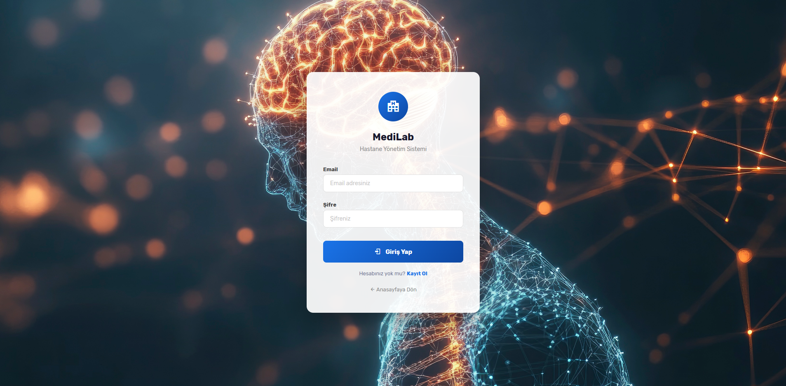

### 🌐 Frontend - Feature
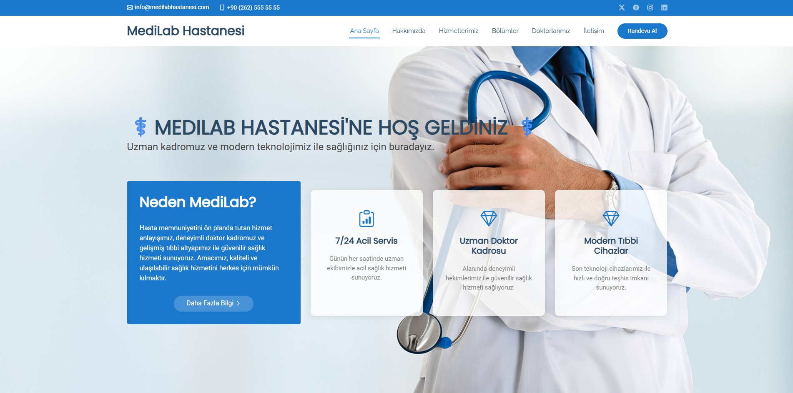

### 🌐 Frontend - About
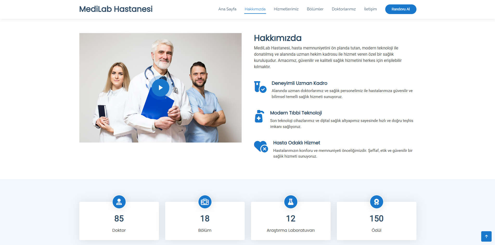

### 🏥 Frontend - Bölümler

### 💊 Frontend - Hizmetler
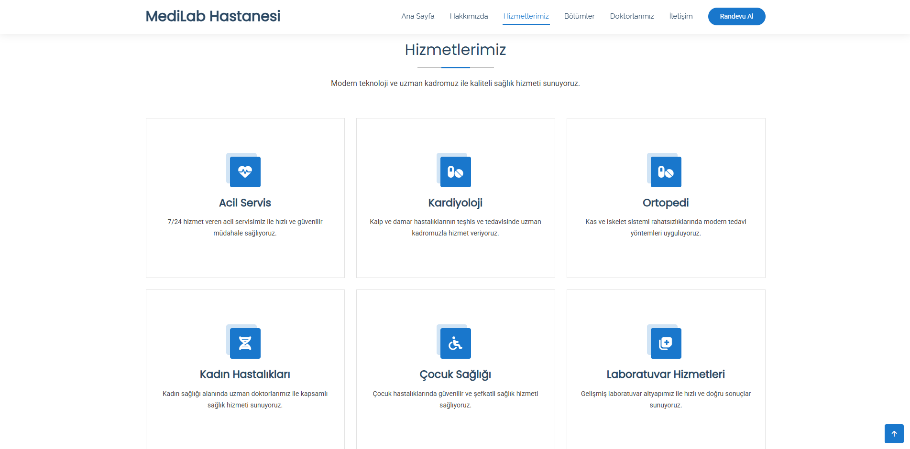

### 👨‍⚕️ Frontend - Doktorlar
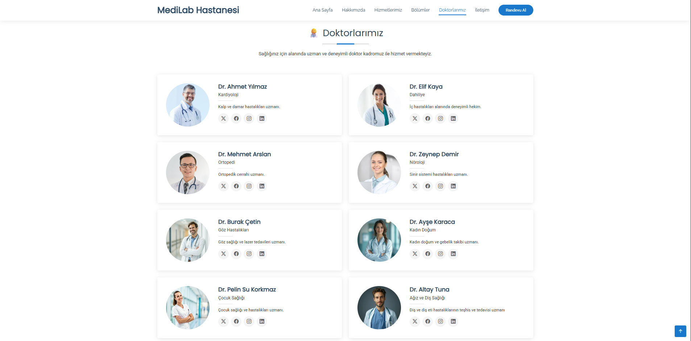

### 💬 Frontend - Testimonials
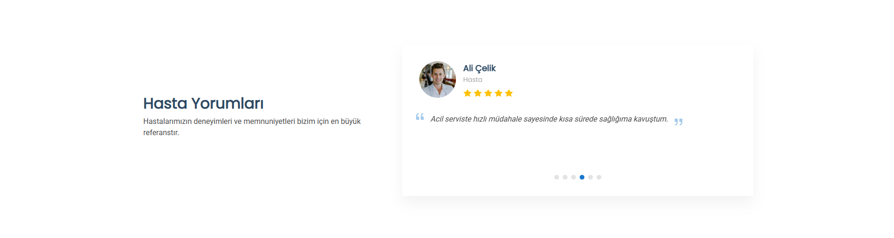

### 📅 Frontend - Randevu
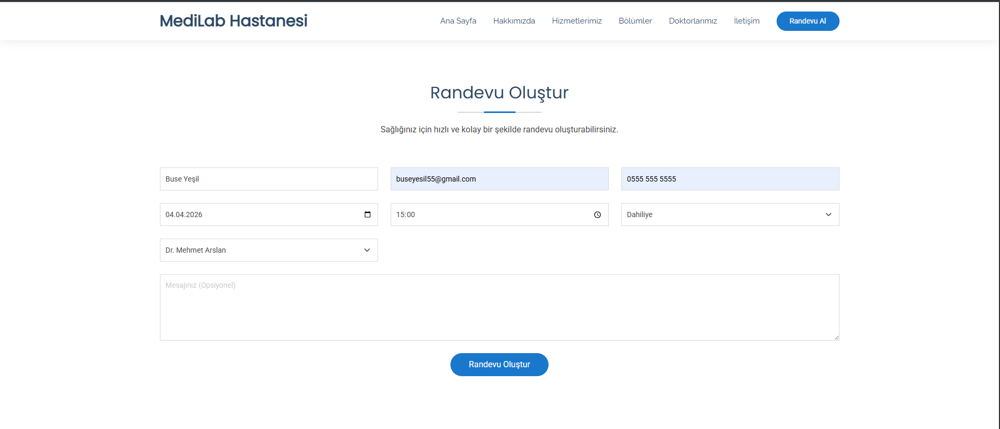

### 📞 Frontend - İletişim
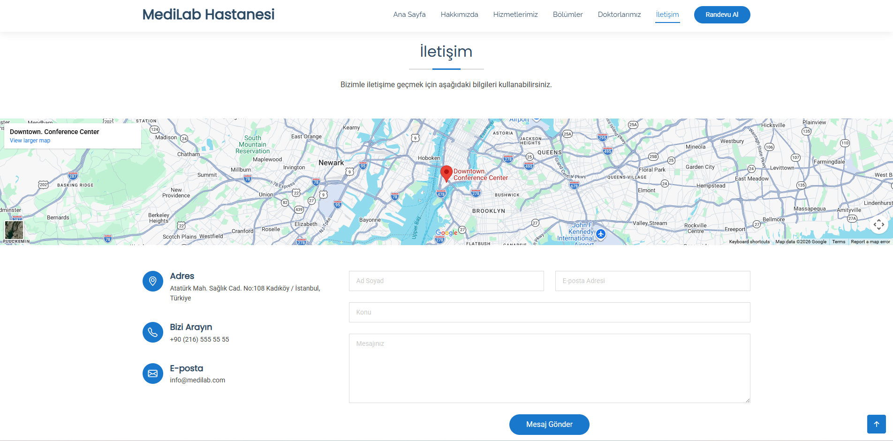

### 🦶 Frontend - Footer
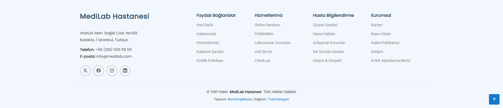

### 📊 Admin - Dashboard
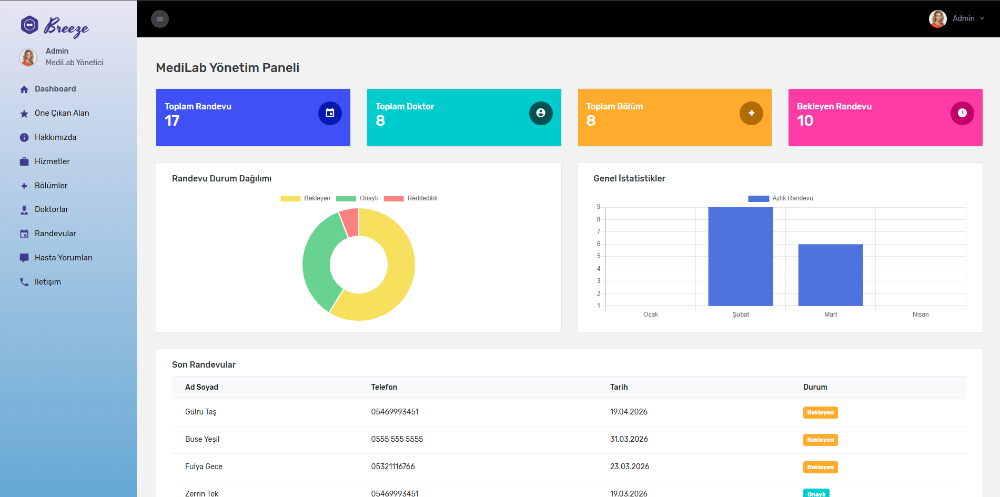

### ⚙️ Admin Paneli
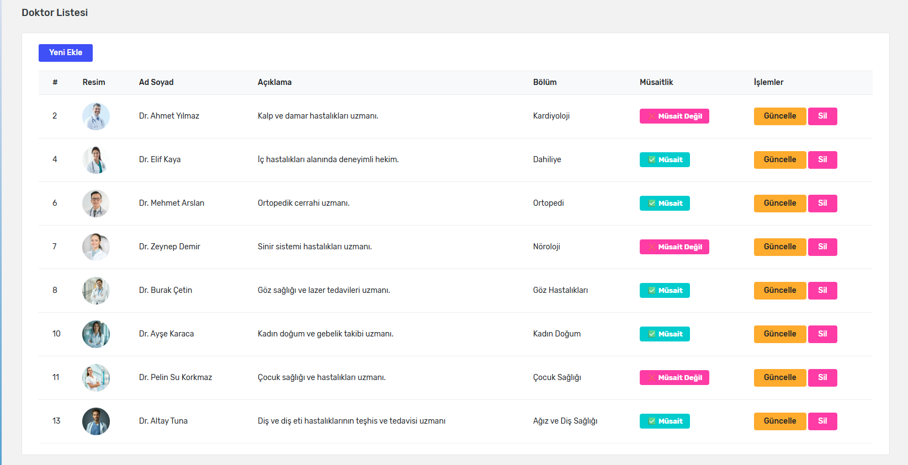

### ⚙️ Admin Paneli 2
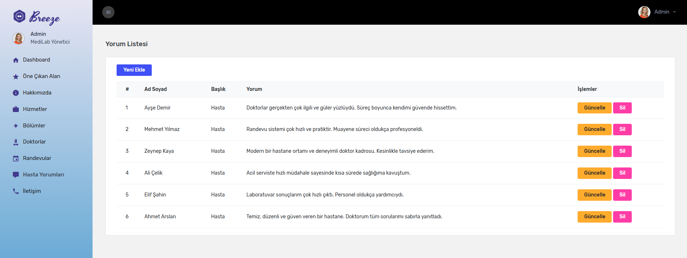

### ⚙️ Admin Paneli 3
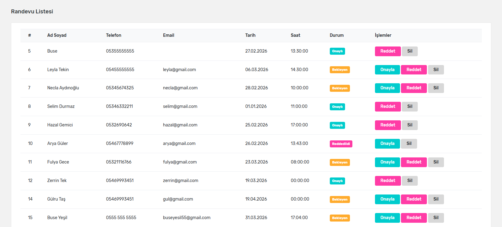

### ⚙️ Admin Paneli 4
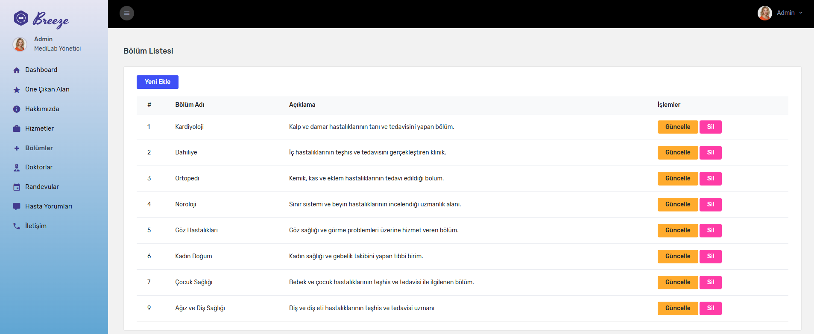

### 👤 Hasta Paneli
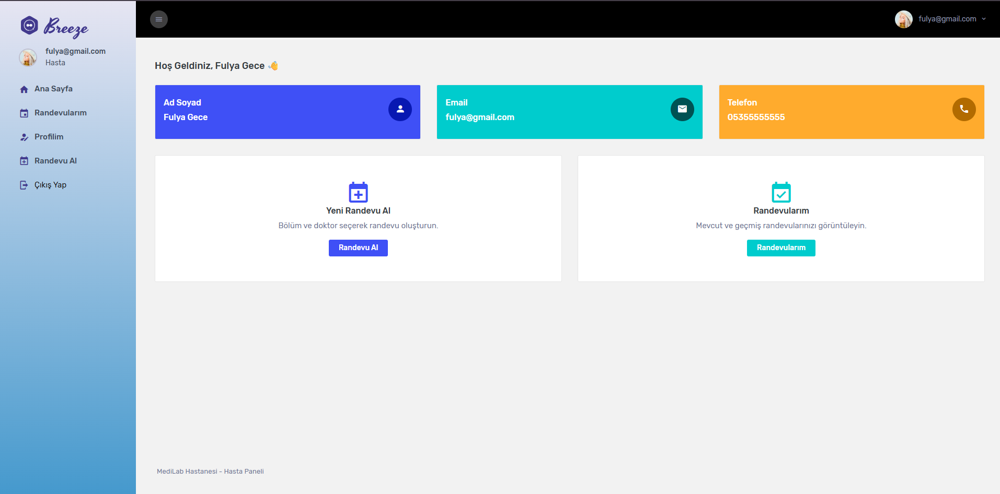

### 👤 Hasta Paneli - Randevularım
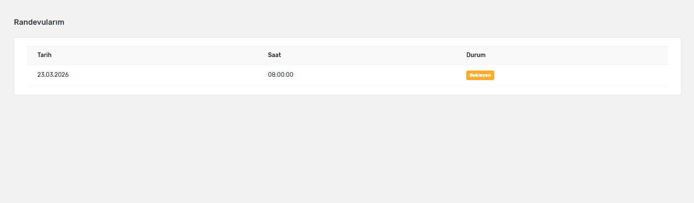

### 👤 Hasta Paneli - Profil
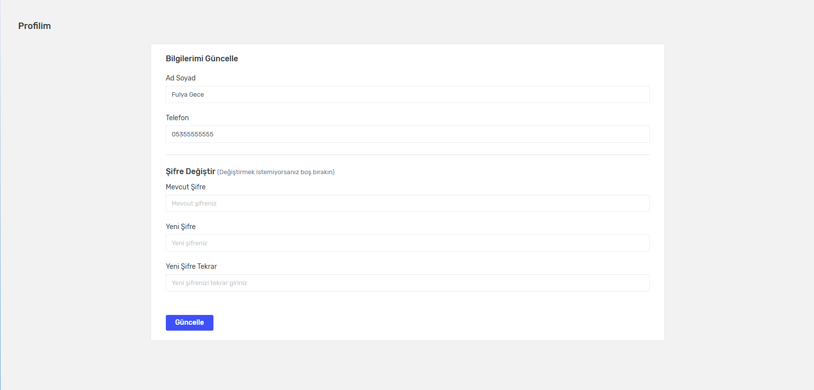

### 📧 Onay Maili
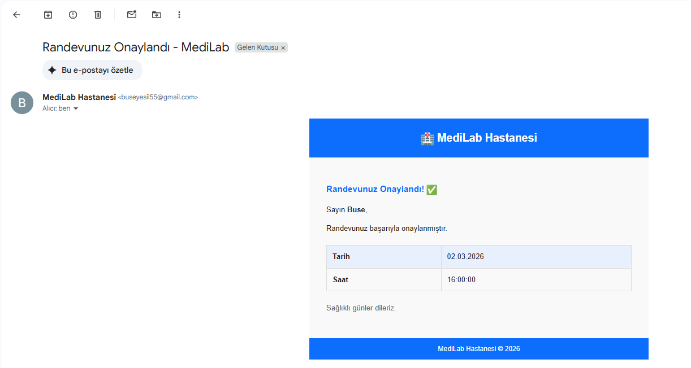